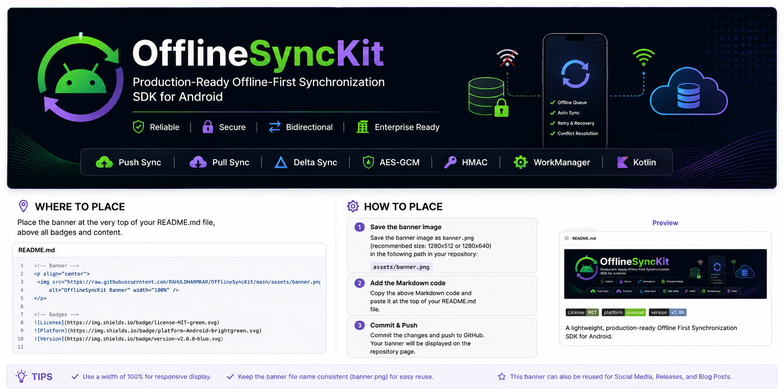

<p align="center">
  
</p>

# OfflineSyncKit

> 🚀 **Production-Ready Offline-First Synchronization SDK for Android**

OfflineSyncKit is a lightweight, secure, and enterprise-ready Android SDK that enables your application to continue working seamlessly without an internet connection.

Instead of losing user actions while offline, OfflineSyncKit automatically stores local operations, retries failed requests, and synchronizes data with your backend when connectivity is restored.

Whether you're building a POS system, healthcare application, CRM, inventory solution, or field-force application, OfflineSyncKit provides a complete synchronization foundation so you can focus on your business logic instead of implementing synchronization infrastructure.


---

# Why OfflineSyncKit?

Building reliable offline synchronization is significantly more difficult than simply storing data locally.

A production-ready synchronization system must solve challenges such as:

* Reliable offline queue management
* Automatic retry handling
* Background synchronization
* Network monitoring
* Data encryption
* Request signing
* Conflict detection
* Push & Pull synchronization
* Delta synchronization
* Multi-tenant support
* Diagnostics & monitoring

OfflineSyncKit provides these capabilities in a reusable Android SDK so you don't need to build and maintain your own synchronization engine.

---

# Typical Use Cases

OfflineSyncKit is suitable for applications where users must continue working even without internet connectivity.

Examples include:

* 🛒 Point of Sale (POS)
* 🏥 Healthcare & Hospital Apps
* 💊 Pharmacy Applications
* 🚚 Delivery Applications
* 📦 Inventory Management
* 👷 Field Service Applications
* 📋 CRM Systems
* 🏭 Manufacturing Applications
* 🧾 Inspection & Survey Apps
* 📱 Enterprise Mobile Applications

---

# Why Not Build It Yourself?

Many Android applications start with a simple offline queue.

Over time that queue grows into a complex synchronization engine requiring months of development and continuous maintenance.

| Without OfflineSyncKit        | With OfflineSyncKit   |
| ----------------------------- | --------------------- |
| Build offline queue manually  | ✅ Built-in            |
| Implement retry logic         | ✅ Included            |
| Handle network recovery       | ✅ Automatic           |
| Configure WorkManager         | ✅ Included            |
| Encrypt payloads              | ✅ AES-GCM Support     |
| Sign requests                 | ✅ HMAC-SHA256         |
| Background synchronization    | ✅ Supported           |
| Push synchronization          | ✅ Supported           |
| Pull synchronization          | ✅ Supported           |
| Bidirectional synchronization | ✅ Supported           |
| Delta synchronization         | ✅ Foundation Included |
| Multi-tenant synchronization  | ✅ Supported           |
| Diagnostics & monitoring      | ✅ Included            |

Instead of spending weeks building synchronization infrastructure, you can focus on delivering features that matter to your users.

---

# Key Features

OfflineSyncKit provides a complete synchronization platform for Android applications.

| Feature                          | Status |
| -------------------------------- | :----: |
| Offline Queue                    |    ✅   |
| Push Synchronization             |    ✅   |
| Pull Synchronization             |    ✅   |
| Bidirectional Synchronization    |    ✅   |
| Delta Synchronization Foundation |    ✅   |
| Automatic Retry Engine           |    ✅   |
| WorkManager Integration          |    ✅   |
| Merge Policies                   |    ✅   |
| Conflict Resolution              |    ✅   |
| Queue Statistics                 |    ✅   |
| Queue Inspector                  |    ✅   |
| Health Reports                   |    ✅   |
| Diagnostics                      |    ✅   |
| AES-GCM Payload Encryption       |    ✅   |
| HMAC Request Signing             |    ✅   |
| Enterprise Authentication        |    ✅   |
| Custom Headers                   |    ✅   |
| Sync Policies                    |    ✅   |
| Multi-Tenant Support             |    ✅   |

---

# Architecture Overview

OfflineSyncKit follows a modular architecture where each component has a single responsibility.

```text
                     Application
                          │
                          ▼
                  OfflineSyncKit
                          │
                          ▼
             BidirectionalSyncEngine
                │                │
                ▼                ▼
          Push Sync         Pull Sync
          (SyncEngine)   (PullSyncEngine)
                │                │
                └────────┬───────┘
                         ▼
              SyncSecurityManager
               │                 │
               ▼                 ▼
        AES-GCM Encryption   HMAC Signing
                         │
                         ▼
                  SyncApiAdapter
                         │
                         ▼
                    Your Backend
```

This architecture keeps synchronization logic modular, testable, and easy to extend while allowing applications to integrate with any backend implementation.

---

# Installation

Add the JitPack repository.

```kotlin
dependencyResolutionManagement {
    repositories {
        google()
        mavenCentral()
        maven {
            url = uri("https://jitpack.io")
        }
    }
}
```

Add the dependency.

```kotlin
dependencies {
    implementation("com.github.RAHULDHARMKAR:OfflineSyncKit:v2.0.0")
}
```

Sync your Gradle project and you're ready to start building offline-first Android applications.

---

# Quick Start

Creating a synchronization client requires only three simple steps.

## Step 1 — Create a SyncClient

```kotlin
val syncKit = SyncClient.Builder(applicationContext)
    .apiAdapter(
        object : SyncApiAdapter {

            override suspend fun sync(
                request: SyncRequest
            ): SyncApiResult {

                return SyncApiResult(
                    success = true
                )
            }
        }
    )
    .build()
```

---

## Step 2 — Enqueue Local Changes

```kotlin
syncKit.enqueue(
    entityName = "customer",
    entityId = "1001",
    operation = SyncOperation.CREATE,
    payload = """
        {
            "name":"Rahul",
            "phone":"9876543210"
        }
    """.trimIndent()
)
```

The SDK automatically stores the operation locally, even if the device is completely offline.

---

## Step 3 — Synchronize

```kotlin
val result = syncKit.syncNow()

println(result.successCount)
println(result.failedCount)
```

OfflineSyncKit automatically handles retries, synchronization, and queue management based on your configured synchronization policies.

---

# Core Synchronization Features

OfflineSyncKit is built around a reliable synchronization engine designed for real-world Android applications.

Instead of forcing applications to implement synchronization logic themselves, the SDK provides a complete synchronization pipeline from local storage to remote server communication.

---

# Offline Queue

Whenever the device is offline, OfflineSyncKit automatically stores operations locally.

Supported operations include:

* ✅ CREATE
* ✅ UPDATE
* ✅ DELETE

Queued operations remain safely stored until synchronization becomes possible.

```kotlin
syncKit.enqueue(
    entityName = "customer",
    entityId = "123",
    operation = SyncOperation.CREATE,
    payload = """
        {
            "name":"Rahul"
        }
    """.trimIndent()
)
```

Unlike traditional networking approaches, no user action is lost simply because the internet connection is unavailable.

---

# Object Serialization

Working directly with JSON strings is possible, but OfflineSyncKit also supports synchronizing Kotlin objects.

```kotlin
data class Customer(
    val id: String,
    val name: String
)
```

```kotlin
val customer = Customer(
    id = "123",
    name = "Rahul"
)

syncKit.enqueueObject(
    entityName = "customer",
    entityId = customer.id,
    operation = SyncOperation.CREATE,
    entity = customer,
    serializer = { customer ->
        gson.toJson(customer)
    }
)
```

---

# Serializer Registry

Instead of passing serializers every time, register them once.

```kotlin
val registry = SyncSerializerRegistry()

registry.register(
    Customer::class,
    SyncSerializer<Customer> {
        gson.toJson(it)
    }
)
```

Configure the registry:

```kotlin
val syncKit = SyncClient.Builder(applicationContext)
    .apiAdapter(apiAdapter)
    .config(
        SyncConfig(
            serializerRegistry = registry
        )
    )
    .build()
```

Now object synchronization becomes much cleaner.

```kotlin
syncKit.enqueueObject(
    entityName = "customer",
    entityId = customer.id,
    operation = SyncOperation.CREATE,
    entity = customer,
    type = Customer::class
)
```

---

# Push Synchronization

Push synchronization uploads locally queued changes to your backend.

```text
Application
      │
      ▼
Offline Queue
      │
      ▼
Sync Engine
      │
      ▼
Your REST API
```

Simply call:

```kotlin
val result = syncKit.syncNow()
```

OfflineSyncKit automatically:

* Processes queued operations
* Applies retry policies
* Handles failures
* Reports statistics
* Executes event callbacks

---

# Pull Synchronization

Pull synchronization downloads remote changes from your backend.

Implement a pull adapter.

```kotlin
class CustomerPullAdapter : SyncPullAdapter {

    override suspend fun pull(
        request: SyncPullRequest
    ): SyncPullResult {

        return SyncPullResult(
            success = true,
            nextSyncToken = "sync-token-001",
            items = listOf(
                SyncPulledItem(
                    entityName = "customer",
                    entityId = "100",
                    operation = SyncOperation.UPDATE,
                    payload = """
                        {
                            "name":"John Doe"
                        }
                    """.trimIndent(),
                    updatedAt = System.currentTimeMillis()
                )
            )
        )
    }
}
```

Register the adapter.

```kotlin
val syncKit = SyncClient.Builder(applicationContext)
    .apiAdapter(pushAdapter)
    .pullAdapter(CustomerPullAdapter())
    .build()
```

OfflineSyncKit automatically:

* Downloads remote changes
* Stores pulled items
* Updates synchronization state
* Saves delta synchronization tokens

---

# Bidirectional Synchronization

Many enterprise applications require both upload and download synchronization.

OfflineSyncKit supports three synchronization modes.

| Direction | Description                  |
| --------- | ---------------------------- |
| PUSH      | Upload local changes only    |
| PULL      | Download server changes only |
| BOTH      | Upload then download         |

Configure using:

```kotlin
SyncConfig(
    syncDirection = SyncDirection.BOTH
)
```

When configured with `BOTH`, the SDK automatically performs:

```text
Local Queue
      │
      ▼
Upload Changes
      │
      ▼
Backend
      │
      ▼
Download Remote Changes
      │
      ▼
Application
```

This ensures both the server and device remain synchronized.

---

# Delta Synchronization

Synchronizing every record repeatedly is inefficient.

OfflineSyncKit supports delta synchronization foundations through:

* Synchronization tokens
* Last synchronization timestamps
* Incremental pull requests

Each successful pull stores synchronization metadata internally, allowing backend APIs to return only modified records.

Benefits include:

* Reduced bandwidth usage
* Faster synchronization
* Lower server load
* Improved battery efficiency

---

# Pull Data Handler

Applications often maintain their own Room database.

OfflineSyncKit allows developers to process pulled items immediately after synchronization.

```kotlin
SyncConfig(
    pullDataHandler = SyncPullDataHandler { items ->

        items.forEach {

            customerRepository.save(
                it.payload
            )

        }

    }
)
```

This keeps the SDK independent from your application's storage layer while making integration straightforward.

---

# Queue Management

OfflineSyncKit includes built-in queue management APIs.

Observe queued items.

```kotlin
syncKit.observeQueue()
```

Observe statistics.

```kotlin
syncKit.observeStats()
```

Pause synchronization.

```kotlin
syncKit.pauseSync()
```

Resume synchronization.

```kotlin
syncKit.resumeSync()
```

Delete a single queue item.

```kotlin
syncKit.deleteItem(queueId)
```

Clear the queue.

```kotlin
syncKit.clearAllItems()
```

These APIs make it easy to build administration screens, debugging tools, or synchronization dashboards inside your application.

---

# Automatic Synchronization

OfflineSyncKit supports multiple synchronization strategies.

Manual synchronization:

```kotlin
syncKit.syncNow()
```

Automatic synchronization when connectivity becomes available:

```kotlin
syncKit.scheduleAutoSync()
```

Periodic synchronization:

```kotlin
SyncConfig(
    enablePeriodicSync = true,
    periodicSyncIntervalMinutes = 15
)
```

Using WorkManager, synchronization continues even when the application is running in the background, providing a reliable offline-first experience.

# Enterprise Features

OfflineSyncKit is designed for applications where reliability, security, and maintainability are critical.

Rather than being just an offline queue, the SDK provides a comprehensive synchronization platform suitable for enterprise Android applications.

---

# Enterprise Security

Applications often synchronize sensitive business data such as customer records, invoices, medical information, inventory, and financial transactions.

OfflineSyncKit provides built-in security features to help protect synchronization data.

## AES-GCM Payload Encryption

Payloads can be encrypted before being stored inside the local synchronization queue.

```kotlin
val encryptionProvider = AesSyncEncryptionProvider(
    keyProvider = DefaultSyncKeyProvider(
        "12345678901234567890123456789012"
            .toByteArray(Charsets.UTF_8)
    )
)

val syncKit = SyncClient.Builder(applicationContext)
    .apiAdapter(apiAdapter)
    .config(
        SyncConfig(
            encryptionProvider = encryptionProvider
        )
    )
    .build()
```

Benefits:

* AES-GCM authenticated encryption
* Protection against local database inspection
* Configurable key providers
* Enterprise-ready security architecture

---

## Payload Signing

OfflineSyncKit supports request signing using HMAC-SHA256.

```kotlin
SyncConfig(
    signatureProvider = HmacSyncSignatureProvider(
        secret = "sample-signing-secret"
            .toByteArray(Charsets.UTF_8)
    )
)
```

Each synchronization request automatically includes:

```text
X-Sync-Signature
```

Benefits:

* Payload integrity verification
* Protection against tampering
* Backend request validation
* Enterprise API compatibility

---

## Authentication Support

Authentication can be supplied dynamically.

```kotlin
SyncConfig(
    authTokenProvider = SyncAuthTokenProvider {
        "Bearer your-access-token"
    }
)
```

This allows applications to refresh access tokens without rebuilding the synchronization client.

---

## Custom Request Headers

Custom headers can be added to every synchronization request.

```kotlin
SyncConfig(
    headerProvider = SyncHeaderProvider {

        mapOf(
            "X-App-Version" to "2.0.0",
            "X-Device" to "Android",
            "X-Company" to "OfflineSyncKit Sample"
        )

    }
)
```

Useful for:

* API versioning
* Device identification
* Tenant routing
* Analytics
* Custom backend requirements

---

# Synchronization Policies

Different applications require different synchronization conditions.

OfflineSyncKit provides configurable synchronization policies.

---

## Always Sync

Synchronize whenever synchronization is requested.

```kotlin
SyncConfig(
    syncPolicy = AlwaysSyncPolicy
)
```

---

## Wi-Fi Only

Synchronize only while connected to Wi-Fi.

```kotlin
SyncConfig(
    syncPolicy = WifiOnlySyncPolicy()
)
```

---

## Charging Only

Synchronize only while the device is charging.

```kotlin
SyncConfig(
    syncPolicy = ChargingOnlySyncPolicy()
)
```

---

## Composite Policies

Multiple synchronization policies can be combined.

```kotlin
SyncConfig(
    syncPolicy = CompositeSyncPolicy.allOf(
        WifiOnlySyncPolicy(),
        ChargingOnlySyncPolicy()
    )
)
```

Synchronization begins only when every configured policy allows execution.

---

# Retry Engine

Network failures are inevitable.

OfflineSyncKit includes a configurable retry engine.

```kotlin
SyncConfig(
    retryPolicy = SyncRetryPolicy(
        maxRetryCount = 5
    )
)
```

Features include:

* Configurable retry count
* Exponential retry support
* Failed item tracking
* GIVE_UP state
* Retry individual items
* Retry all failed items

---

# Merge Policies

Duplicate queue entries can be managed automatically.

Supported merge policies include:

* APPEND_ONLY
* REPLACE_SAME_ENTITY
* REPLACE_SAME_ENTITY_OPERATION

Example:

```kotlin
SyncConfig(
    mergePolicy = SyncMergePolicy.REPLACE_SAME_ENTITY
)
```

---

# Conflict Resolution

Synchronization conflicts can occur when both server and client modify the same entity.

OfflineSyncKit supports configurable conflict strategies.

```kotlin
SyncConfig(
    conflictStrategy = SyncConflictStrategy.MANUAL
)
```

Or provide a custom resolver.

```kotlin
SyncConfig(
    conflictResolver = SyncConflictResolver {

        SyncConflictResolution.MarkManual

    }
)
```

Current strategies:

* LOCAL_WINS
* SERVER_WINS
* MANUAL
* Custom Resolver

---

# Synchronization Events

Applications can observe the complete synchronization lifecycle.

```kotlin
SyncConfig(
    eventListener = SyncEventListener { event ->

        Log.d(
            "SyncEvent",
            event.toString()
        )

    }
)
```

Supported events include:

* Enqueued
* Started
* Success
* Failed
* Conflict
* GiveUp

Useful for:

* Analytics
* Notifications
* Debugging
* Progress indicators

---

# Logging

OfflineSyncKit provides configurable logging.

```kotlin
SyncConfig(
    logger = SyncLogger { message ->

        Log.d(
            "OfflineSyncKit",
            message
        )

    }
)
```

Logs include:

* Queue operations
* Synchronization lifecycle
* Retry attempts
* Security operations
* Pull synchronization
* Bidirectional synchronization

---

# Diagnostics

Built-in diagnostics help developers understand synchronization behavior.

Diagnostics include:

* Queue state
* Retry information
* Synchronization statistics
* Current configuration
* Policy evaluation
* Health information

Ideal for:

* Development
* QA
* Production troubleshooting

---

# Queue Statistics

Monitor synchronization performance.

```kotlin
val stats = syncKit.getStatistics()
```

Available statistics include:

* Pending Count
* Syncing Count
* Synced Count
* Failed Count
* Conflict Count
* Give Up Count

These metrics can be displayed inside administration dashboards or monitoring screens.

---

# Multi-Tenant Synchronization

OfflineSyncKit supports tenant-aware synchronization.

Provide a tenant provider.

```kotlin
SyncConfig(
    tenantProvider = SyncTenantProvider {

        "tenant_001"

    }
)
```

Tenant information is automatically applied during:

* Queue storage
* Push synchronization
* Pull synchronization
* Delta synchronization
* Queue filtering

This makes OfflineSyncKit suitable for SaaS and enterprise applications supporting multiple organizations.

---

# Extensible Architecture

OfflineSyncKit is designed to integrate with existing applications rather than replace them.

Developers can customize:

* API communication
* Authentication
* Request headers
* Serialization
* Encryption
* Signing
* Synchronization policies
* Conflict resolution
* Pull processing
* Event handling
* Logging

This extensibility allows the SDK to work with virtually any REST API or backend architecture.

---

# Designed for Production

OfflineSyncKit is suitable for:

* Enterprise Android Applications
* Point of Sale Systems
* Healthcare Solutions
* Inventory Management
* Delivery Platforms
* CRM Applications
* Manufacturing Systems
* Field Service Applications

The SDK focuses on reliability, extensibility, and long-term maintainability while remaining lightweight and easy to integrate.

# Sample Application

The repository includes a fully functional Android sample application demonstrating the complete OfflineSyncKit workflow.

The sample showcases:

* ✅ Offline Queue
* ✅ Push Synchronization
* ✅ Pull Synchronization
* ✅ Bidirectional Synchronization
* ✅ Object Serialization
* ✅ AES-GCM Encryption
* ✅ HMAC Payload Signing
* ✅ Retry Policies
* ✅ Sync Policies
* ✅ Queue Statistics
* ✅ Diagnostics
* ✅ Multi-Tenant Support

The sample application is intended to serve as a reference implementation for integrating OfflineSyncKit into production Android applications.

---

# Roadmap

OfflineSyncKit is under active development.

## ✅ Version 1.x

* Offline Queue
* Automatic Retry Engine
* WorkManager Integration
* Queue Statistics
* Queue Inspector
* Diagnostics
* Health Reports
* Enterprise Security
* Sync Policies

---

## ✅ Version 2.0

* Push Synchronization
* Pull Synchronization
* Bidirectional Synchronization
* Delta Synchronization Foundation
* Multi-Tenant Synchronization
* Pull Data Handler
* Sync State Management

---

## 🚀 Version 2.1

Planned features:

* Advanced Conflict Merge Engine
* Field-Level Merge Strategies
* JSON Merge Strategies
* Merge Reports
* Advanced Conflict Resolution

---

## 🚀 Version 2.2

Planned features:

* Remote Entity Cache
* Selective Entity Synchronization
* Background Pull Improvements
* Advanced Sync Scheduler

---

## 🚀 Version 3.0

Long-term vision:

* Real-time Synchronization
* WebSocket Support
* Live Change Streams
* Collaborative Offline Editing
* Cross-Device Synchronization

---

# Frequently Asked Questions

## Does OfflineSyncKit require Firebase?

No.

OfflineSyncKit is backend-agnostic and works with any REST API or custom backend implementation.

---

## Does it support Room?

Yes.

OfflineSyncKit uses Room internally for queue management and can also integrate with your application's Room database through the Pull Data Handler.

---

## Does it support Retrofit?

Yes.

Retrofit works perfectly as the networking layer behind `SyncApiAdapter`.

---

## Does it support Ktor?

Yes.

Any networking library can be used by implementing the adapter interfaces provided by the SDK.

---

## Can I use it in commercial applications?

Yes.

OfflineSyncKit is released under the MIT License.

---

## Is internet required?

No.

OfflineSyncKit is specifically designed for offline-first applications.

Operations continue to work without network connectivity and synchronize automatically when connectivity becomes available.

---

## Can I encrypt queued data?

Yes.

AES-GCM encryption is built into the SDK and can be enabled through `SyncConfig`.

---

## Does OfflineSyncKit support multi-tenant applications?

Yes.

Applications can provide a `SyncTenantProvider` and the SDK automatically propagates tenant information throughout the synchronization pipeline.

---

# Performance

OfflineSyncKit is designed to remain lightweight while supporting enterprise-scale synchronization.

Design goals include:

* Low memory usage
* Efficient Room queries
* Background execution using WorkManager
* Incremental synchronization
* Delta synchronization support
* Configurable synchronization batches

---

# Compatibility

| Component       | Requirement      |
| --------------- | ---------------- |
| Android Min SDK | 24               |
| Kotlin          | 2.x              |
| Java            | 11+              |
| Android Studio  | Ladybug or newer |
| Jetpack Compose | Supported        |
| Room            | Supported        |
| WorkManager     | Supported        |

---

# Contributing

Contributions are welcome.

You can contribute by:

* Reporting bugs
* Suggesting new features
* Improving documentation
* Writing tests
* Optimizing performance
* Submitting pull requests

Please ensure that new features include appropriate documentation and tests where applicable.

---

# Reporting Issues

If you encounter a bug or have a feature request, please open an issue on GitHub.

When reporting issues, include:

* Android version
* Device model
* OfflineSyncKit version
* Stack trace (if available)
* Steps to reproduce

This helps us investigate and resolve issues more efficiently.

---

# Versioning

OfflineSyncKit follows **Semantic Versioning**.

* MAJOR — Breaking API changes
* MINOR — New features
* PATCH — Bug fixes and improvements

Example:

```
2.0.0
│ │ │
│ │ └── Patch
│ └──── Minor
└────── Major
```

---

# License

```
MIT License
```

Copyright (c) Rahul Dharmkar

Permission is hereby granted, free of charge, to any person obtaining a copy of this software and associated documentation files to deal in the Software without restriction, including without limitation the rights to use, copy, modify, merge, publish, distribute, sublicense, and/or sell copies of the Software.

See the LICENSE file for the complete license text.

---

# Support

If OfflineSyncKit helps your project, consider:

⭐ Starring the repository on GitHub.

🐛 Reporting issues and suggesting improvements.

🤝 Contributing through pull requests.

Your feedback helps make OfflineSyncKit more reliable for the Android developer community.

---

# Acknowledgements

OfflineSyncKit is built using modern Android technologies including:

* Kotlin
* Coroutines
* Room
* WorkManager
* Jetpack
* AndroidX

Special thanks to the Android developer community for continuously inspiring better tools and libraries.
